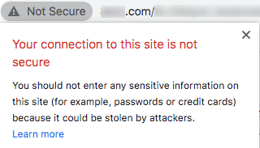

# Processo de solicitação de certificado SSL

Depois de delegar um domínio ao Adobe para enviar emails (consulte [Domain name setup](/help/additional-resources/ac-domain-name-setup.md)), o Adobe criará e usará determinados subdomínios para funções específicas.

Por exemplo, se você tiver delegado *email.example.com* ao Adobe para enviar emails, o Adobe criará subdomínios como o seguinte:
* *t.email.example.com*  - para links de rastreamento
* *m.email.example.com*  - para mirror pages
* *res.email.example.com*  - para recursos hospedados (como imagens)

É recomendável **proteger esses domínios por SSL (HTTPS)**. Na verdade, os links não seguros (HTTP) são vulneráveis à interceptação e sinalizarão avisos nos navegadores modernos.

Para instalar certificados SSL nesses subdomínios, o processo envolve solicitar um arquivo CSR e, subsequentemente, comprar certificados SSL para o Adobe para instalar ou renovar.

>[!CAUTION]
>
>Antes de instalar um certificado SSL, verifique se você está ciente dos pré-requisitos listados em [this page](https://experienceleague.adobe.com/docs/control-panel/using/subdomains-and-certificates/renewing-subdomain-certificate.html#installing-ssl-certificate).
>
>O Adobe suporta apenas certificados de até 2048 bits. Certificados de 4096 bits ainda não são suportados.

## Glossário

| Termo | Descrição |
|--- |--- |
| CA (Autoridade de certificação) | Um provedor de certificados SSL que emite certificados digitais para organizações ou indivíduos após verificar sua identidade, como DigiCert, Symantec etc.<ul><li>Geralmente, uma CA confiável é considerada uma CA de terceiros que emite um certificado raiz.</li><li>Se o certificado for assinado pela mesma organização/empresa que está usando o certificado, ele será classificado como CA não confiável mesmo quando forem certificados SSL, como certificados autoassinados.</li></ul> |
| Certificado da cadeia | Um certificado que inclui um certificado raiz e um ou mais certificados intermediários é chamado de certificado em cadeia (ou encadeado). |
| CSR (Solicitação de assinatura de certificado) | Um bloco de texto codificado fornecido a uma autoridade de certificação ao solicitar um certificado SSL. Geralmente é gerado no servidor onde o certificado está instalado. |
| DER (Regras de Codificação Distintas) | Um tipo de extensão de certificado. A extensão .der é usada para certificados codificados DER binários. Esses arquivos também podem oferecer suporte à extensão .cer ou .crt. |
| Certificado EV (validação estendida) | Um certificado EV é um novo tipo de certificado criado para impedir ataques de phishing. Requer validação estendida de sua empresa e da pessoa que solicita o certificado. |
| Certificado de garantia de alto nível | Os certificados de alta garantia são emitidos pela autoridade de certificação após verificar a propriedade do nome de domínio e o registro comercial válido. |
| CA intermediário | Uma autoridade de certificação de certificados intermediários incluídos em um certificado de cadeia. |
| Certificado intermediário | Uma autoridade de certificação emite certificados no formato de uma estrutura em árvore. O certificado raiz é o certificado mais alto da árvore. Qualquer certificado entre seu certificado e o certificado raiz é chamado de certificado de cadeia ou intermediário. |
| Certificado de baixa garantia | Um certificado de baixa garantia, também conhecido como certificado validado por domínio, inclui somente o nome de domínio no certificado (e não o nome da empresa/organização). |
| PEM (Privacy Enhanced Mail) | Um certificado com uma extensão .pem que contém dados ASCII (Base64). Esses certificados começam com uma linha &quot; - - - - - - BEGIN CERTIFICATE - - - - - &quot;. |
| Certificado raiz | Uma autoridade de certificação emite certificados no formato de uma estrutura em árvore. O certificado raiz é o certificado mais alto da árvore. |
| SAN (Subject Alternative Name) | Os nomes alternativos do assunto são nomes de host adicionais (sites, endereços IP, nomes comuns etc.) que deve ser assinado como parte de um único certificado SSL. |
| Certificado autoassinado | Um certificado que é assinado pela pessoa que o cria, em vez de uma autoridade de certificação confiável. Certificados autoassinados podem habilitar o mesmo nível de criptografia de um certificado assinado por uma CA, mas há duas desvantagens principais:<ul><li>A conexão de um visitante pode ser sequestrada, permitindo que um invasor visualize todos os dados enviados (derrubando a finalidade de criptografar a conexão)</li><li> O certificado não pode ser revogado como um certificado confiável pode.</li></ul> |
| SSL (Secure Sockets Layer) | A tecnologia de segurança padrão para estabelecer um link criptografado entre um servidor da Web e um navegador. |
| Certificado curinga | Um certificado curinga pode proteger um número ilimitado de subdomínios de primeiro nível em um único nome de domínio, como *.adobe.com. |

## Etapas principais

1. Solicite um arquivo de Solicitação de assinatura de certificado (CSR) e forneça as informações necessárias (país, estado, cidade, nome da organização, nome da unidade organizacional etc.) para Adobe.
1. Valide o arquivo CSR gerado pelo Adobe e verifique se todas as informações fornecidas estão corretas.
1. Use os detalhes da CSR para gerar um certificado assinado por uma autoridade de certificação confiável<!--taking care of asking for using the subjectAltName SSL extension (SAN) if it is for several domain names, and get/purchase the resulting certificate (ideally) in PEM format for Apache server-->.
1. Valide o certificado SSL e verifique se ele corresponde ao CSR.
1. Forneça o certificado SSL ao Adobe, que o instalará.
1. Teste se o certificado SSL foi instalado com êxito para cada subdomínio seguro.
1. Monitore o período de validade do certificado SSL.
1. Atualize qualquer configuração específica no Adobe Campaign.

## Processo detalhado

### Pré-requisitos

Você deve identificar os nomes de domínio e as funções (rastreamento, mirror pages, aplicativos da Web etc.) para proteger.
>[!NOTE]
>
>O Adobe pode ajudar a definir os nomes de domínio e as funções a serem envolvidas. Para obter mais informações, entre em contato com o Gerente de sucesso do cliente do Adobe.

### Etapa 1 - Obter um arquivo CSR

Para obter um arquivo CSR (Solicitação de assinatura de certificado), siga as etapas abaixo.

* Se você tiver acesso ao [Painel de controle](https://experienceleague.adobe.com/docs/control-panel/using/control-panel-home.html?lang=pt-BR), siga as instruções em [esta página](https://experienceleague.adobe.com/docs/control-panel/using/subdomains-and-certificates/renewing-subdomain-certificate.html#subdomains-and-certificates) para gerar e baixar um arquivo CSR no Painel de controle do Campaign.

* Caso contrário, crie um tíquete de suporte via https://adminconsole.adobe.com/ para obter um arquivo CSR do Adobe Customer Care para o(s) subdomínio(s) necessário(s).

Estas são algumas das práticas recomendadas a seguir:

* Levante uma solicitação por subdomínio delegado.
* É possível combinar vários subdomínios em uma única solicitação de CSR, mas somente no mesmo ambiente. Por exemplo, no Campaign Classic, o servidor de marketing, o [servidor mid-sourcing](https://experienceleague.adobe.com/docs/campaign-classic/using/installing-campaign-classic/install-campaign-on-prem/mid-sourcing-server.html) e o [execution instance](https://experienceleague.adobe.com/docs/campaign-classic/using/transactional-messaging/configure-transactional-messaging/configuring-instances.html#execution-instance) são três ambientes separados.
* Você deve obter um novo CSR antes de qualquer renovação de certificado SSL. Não use um arquivo CSR antigo de um ano ou mais.

Você precisará fornecer as seguintes informações.

>[!CAUTION]
>
>Todos os campos indicados nas tabelas abaixo devem ser preenchidos. Caso contrário, a solicitação de CSR não poderá ser processada.

**Informações a fornecer com a assistência da equipe de Adobe:**

| Informações a fornecer | Exemplo de valor | Observação |
|--- |--- |--- |
| Nome do cliente | My Company Inc. | Nome da sua organização. Este campo é usado pelo Adobe para rastrear sua solicitação (ele não fará parte do certificado CSR/SSL). |
| URL do ambiente Adobe Campaign | https://client-mid-prod1.campaign.adobe.com | URL da instância do Adobe Campaign. |
| Nome comum [CN] | t.subdomain.customer.com | Pode ser qualquer um dos domínios relevantes, mas geralmente o domínio de rastreamento. |
| Nome alternativo do assunto [SAN] | t.subdomain.customer.com | Certifique-se de incluir o subdomínio de rastreamento como uma SAN. |
| Nome alternativo do assunto [SAN] | m.subdomain.customer.com |
| Nome alternativo do assunto [SAN] | res.subdomain.customer.com |

**Informações a serem fornecidas pela equipe interna de TI/SSL:**

| Informações a fornecer | Exemplo de valor | Observação |
|--- |--- |--- |
| País [C] | US | Deve ser um código de duas letras. Acesse a lista completa de países [aqui](https://www.ssl.com/csrs/country_codes/). *Observação: Para o Reino Unido, use GB (não Reino Unido).* |
| Estado (ou Nome da Província) [ST] | Illinois | Se aplicável. O valor deve ser um nome completo, não abreviado. |
| Nome da Cidade/Localidade [L] | Chicago |
| Nome da Organização [O] | ACME |
| Nome da Unidade Organizacional [OU] | IT |

>[!NOTE]
>
>Substitua &quot;subdomain.customer.com&quot; pelo seu subdomínio delegado e os outros valores de exemplo pelos valores apropriados.

### Etapa 2 - Validar o arquivo CSR

Depois de enviar sua solicitação com as informações relevantes, o Adobe gera e fornece um arquivo de Solicitação de assinatura de certificado (CSR).

O texto no arquivo CSR resultante deve começar com **&quot;—BEGIN CERTIFICATE REQUEST—&quot;**.

Depois de receber o arquivo CSR do Adobe, siga as etapas abaixo:

1. Copie e cole o texto do arquivo CSR em um decodificador online, como https://www.sslshopper.com/csr-decoder.html, <!--https://www.certlogik.com/decoder/,--> ou https://www.entrust.net/ssl-technical/csr-viewer.cfm.
Como alternativa, você pode usar o comando *OpenSSL* localmente em uma máquina Linux. Para obter mais informações, consulte [esta página externa](https://www.question-defense.com/2009/09/22/use-openssl-to-verify-the-contents-of-a-csr-before-submitting-for-a-ssl-certificate).
1. Verifique se todas as verificações foram bem-sucedidas.
1. Verifique se os parâmetros e nomes de domínio corretos foram incluídos.
1. Verifique se todos os outros dados correspondem aos detalhes fornecidos ao enviar sua solicitação.

### Etapa 3 - Gerar o certificado SSL

Depois que o arquivo CSR for fornecido, você deverá comprar e gerar um certificado SSL para os domínios apropriados usando o arquivo CSR.

* O certificado SSL:
   * deve estar no formato Apache PEM;
   * não deve ser superior a 2048 bits;
   * deve ser assinado por uma autoridade de certificação (autoridade de certificação) válida;
   * O deve incluir todas as SANs (Subject Alternative Names), conforme mencionado no arquivo CSR.
* Se houver um ou mais certificados intermediários, você deverá fornecer o certificado raiz e todos os certificados intermediários ao Adobe.
* Você pode definir qualquer período de validade do certificado, mas o Adobe recomenda escolhê-lo por tempo suficiente (dois anos, por exemplo).

>[!NOTE]
>
>Se você estiver usando suas próprias ferramentas internas ou um portal fornecido por uma CA para solicitar o certificado, certifique-se de usar os mesmos detalhes fornecidos na solicitação de CSR para evitar atrasos ou discrepâncias no processo de geração de certificado.

### Etapa 4 - Validar o certificado SSL

Depois que o certificado SSL é gerado, você deve validá-lo antes de enviá-lo para o Adobe. Para isso, siga as etapas abaixo:

1. Certifique-se de que o certificado tenha a extensão .pem. Se esse não for o caso, converta-o no formato PEM. Você pode fazer a conversão usando *OpenSSL*.
1. Confirme se o certificado começa com **&quot;—BEGIN CERTIFICATE—&quot;**.
1. Copie o texto do certificado em um decodificador online, como https://www.sslshopper.com/certificate-decoder.html ou https://www.entrust.net/ssl-technical/csr-viewer.cfm.
Como alternativa, você pode usar o comando *OpenSSL* localmente em uma máquina Linux. Para obter mais informações, consulte [esta página externa](https://www.shellhacks.com/decode-ssl-certificate/).
1. Certifique-se de que o certificado seja resolvido corretamente, incluindo o Nome Comum, SAN, Emissor e Período de Validade.
1. Se a verificação do certificado SSL for bem-sucedida, verifique se o certificado corresponde à CSR usando [este site](https://www.sslshopper.com/certificate-key-matcher.html): selecione **Verifique se uma CSR e um certificado correspondem a** e insira seu certificado e sua CSR nos campos correspondentes. Eles deveriam combinar.

### Etapa 5 - Solicitar a instalação do certificado SSL

* Se você tiver acesso ao [Painel de controle](https://experienceleague.adobe.com/docs/control-panel/using/control-panel-home.html), siga as instruções em [esta página](https://experienceleague.adobe.com/docs/control-panel/using/subdomains-and-certificates/renewing-subdomain-certificate.html#installing-ssl-certificate) para fazer upload do certificado para o Painel de controle do Campaign.

* Caso contrário, crie outro tíquete de suporte via https://adminconsole.adobe.com/ para solicitar o Adobe para instalar o certificado no(s) servidor(es) do Adobe.

Você precisará fornecer:

* O arquivo de certificado, o certificado raiz e quaisquer certificados intermediários (anexados ao ticket), de preferência no formato Apache PEM.
* O número do tíquete de suporte anterior gerado para o CSR.
* Os mesmos dados fornecidos para o tíquete CSR (incluindo Nome comum, URL da instância, Estado, Cidade/Localidade, Nome da organização, Nome da unidade da organização etc.).

### Etapa 6 - Testar a instalação do certificado SSL

Depois que o certificado SSL for instalado e confirmado pelo Atendimento ao cliente do Adobe, verifique se ele foi instalado com êxito para todos os URLs.

Execute os testes abaixo antes de fechar o tíquete de instalação SSL. Certifique-se também de atualizar qualquer configuração específica conforme instruído em [this section](#update-configuration).

Navegue até os seguintes URLs em seu navegador (substitua &quot;subdomain.customer.com&quot; por seu subdomínio):

* https://subdomain.customer.com/r/test (somente para subdomínios [web applications](https://experienceleague.adobe.com/docs/campaign-classic/using/designing-content/web-applications/about-web-applications.html) - não se aplica a subdomínios de email)
* https://t.subdomain.customer.com/r/test
* https://m.subdomain.customer.com/r/test
* https://res.subdomain.customer.com/r/test

Um resultado bem-sucedido fornece informações sobre o ambiente, e a barra de endereços no URL indica que a conexão é segura. Por exemplo, você pode ver a seguinte mensagem no Google Chrome:

Se o certificado SSL não estiver instalado corretamente, o seguinte aviso será exibido:

### Etapa 7 - Verificar o período de validade do certificado

Você pode verificar o período de validade do certificado em seu navegador. Por exemplo, no Google Chrome, clique em **Seguro** > **Certificado**.

É sua responsabilidade verificar o período de validade. O Adobe recomenda implementar um processo para monitorar a expiração do certificado. Saiba mais sobre o que acontece quando seu certificado SSL expira em [este artigo](https://www.thesslstore.com/blog/what-happens-when-your-ssl-certificate-expires/).

* Crie um tíquete de suporte para solicitar um certificado atualizado pelo menos duas semanas antes da data de expiração do certificado. Não é necessário solicitar uma CSR adicional, a menos que os detalhes da CSR tenham sido alterados.

* Se você tiver acesso ao [Painel de controle](https://experienceleague.adobe.com/docs/control-panel/using/control-panel-home.html) e se o seu ambiente for hospedado pelo Adobe em um ambiente AWS, poderá usar o Painel de controle do Campaign para renovar o certificado antes que ele expire. Saiba mais [nesta seção](https://experienceleague.adobe.com/docs/control-panel/using/subdomains-and-certificates/monitoring-ssl-certificates.html#monitoring-certificates).

### Etapa 8 - Atualizar qualquer configuração específica {#update-configuration}

Depois de confiar que os certificados SSL solicitados estão instalados corretamente, você pode atualizar todas as referências no Adobe Campaign de HTTP para HTTPS.

>[!NOTE]
>
>Para o Campaign Classic, os URLs a serem atualizados estão localizados principalmente no [Assistente de implantação](https://experienceleague.adobe.com/docs/campaign-classic/using/installing-campaign-classic/initial-configuration/deploying-an-instance.html#deployment-wizard) e no [External accounts](https://experienceleague.adobe.com/docs/campaign-classic/using/installing-campaign-classic/additional-configurations/external-accounts.html#installing-campaign-classic) (rastreamento, mirror page e domínios de recursos públicos). Para o Campaign Standard, consulte [Configuração de marca](https://experienceleague.adobe.com/docs/campaign-standard/using/administrating/application-settings/branding.html#about-brand-identity).

Depois que as configurações forem atualizadas, novos emails serão enviados com URLs HTTPS em vez de HTTP. Para verificar se os URLs agora estão seguros, você pode executar rapidamente os seguintes testes:

* Carregue uma imagem do Adobe Campaign. Depois que a imagem é carregada, o URL retornado deve ser HTTPS.
* Crie um delivery de email de teste incluindo um link de mirror page, algumas imagens, texto e um link de unsubscription. Envie o email para uma ID de email externa (como seu endereço Gmail). Depois de recebido, abra o email e verifique se todos os links dentro do email estão abertos corretamente em seu formulário HTTPS (não HTTP), sem avisos ou erros de certificado SSL.

## Recursos específicos do produto

**Campaign Classic**

* [Painel de controle do Campaign: Adicionar certificados SSL (tutorial)](https://experienceleague.adobe.com/docs/campaign-classic-learn/control-panel/subdomains-and-certificates/adding-ssl-certificates.html)  - saiba como adicionar certificados SSL para proteger seus subdomínios.

**Campaign Standard**

* [Painel de controle do Campaign: Adicionar certificados SSL (tutorial)](https://experienceleague.adobe.com/docs/campaign-standard-learn/control-panel/subdomains-and-certificates/adding-ssl-certificates.html)  - saiba como adicionar certificados SSL para proteger seus subdomínios.
