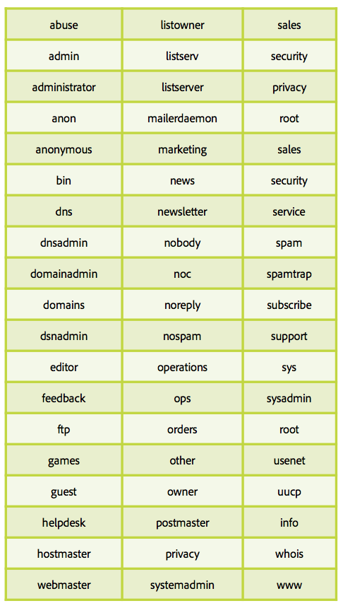

# Tudo sobre armadilhas de spam

A [interceptação de spam](/help/metrics/spam-traps.md) é um endereço válido, sem mensagem de erro quando os emails são enviados para o. Uma interceptação de spam tem uma missão principal: identificar remetentes de spam ou remetentes sem processo de higiene de dados.

## Quem gerencia esses endereços de interceptação de spam?

O primeiro tipo de endereço de cobertura de spam é a empresa de inclui na lista de bloqueios IP e Domínio, como SpamHaus, Sorbs, SpamCop. Essas empresas têm uma enorme rede de endereços que são enviados em várias páginas da Internet como site, blog, fóruns para que seus endereços sejam coletados por remetentes de spam.

O segundo tipo de cobertura de spam é baseado em endereços ISP ativos antigos. Esses ISPs têm sua própria rede de interceptação de spam criada em endereços inativos reconvertidos na interceptação e cada ocorrência afeta o IP do remetente e a reputação do domínio.

## Como funciona?

**Um endereço de email sem o usuário final**: esses endereços não têm e nunca terão um usuário final que possa se registrar em boletins informativos ou qualquer outro tipo de comunicação.

**Um endereço de email abandonado por um usuário**: após um período de inatividade, os endereços são desativados pelos ISPs. As mensagens de rejeição são enviadas aos remetentes para informá-los sobre esse novo status. Os remetentes devem colocar esses endereços em quarentena ou removê-los de comunicações futuras. Os ISPs usam esses endereços transformados em &quot;interceptação de spam&quot; para monitorar remetentes com práticas incorretas.

## Como reconhecer ou identificar uma interceptação de spam?

É um trabalho difícil identificar armadilhas de spam. Esses endereços devem permanecer anônimos, pois são usados para identificar remetentes inválidos. A maioria dos ISPs não tem sistema de clique e abertura para monitorar ocorrências de remetentes inválidos. De acordo com definições anteriores, é possível determinar um pod de endereços suspeitos e testar a eficiência da seleção do pod.

## Por que seu banco de dados está infectado por armadilhas de spam?

O banco de dados de endereços de email contém interceptação de spam. Como isso seria possível? Os dois principais motivos são a falta no processo de higiene do banco de dados ou a disfunção do coletor.

Estes poucos pontos o ajudarão a verificar seus processos:

* Coletar disfunção:
   * De onde seus endereços de email estão vindo? Quantas fontes são usadas para coletar esses endereços? Você consegue identificá-los? Interno/co-registro?
   * O seu sistema de opt-in está funcionando corretamente?
   * Você verificou os domínios e alias de seus endereços? Faça isso com a tabela abaixo!
* Processo de higiene do banco de dados:
   * Qual é o seu processo em relação ao endereço inativo nos últimos 12 meses?
   * Você está processando uma quarentena em devoluções temporárias como ‘usuário inativo’?
   * Quando foi a última vez que você cuidou do banco de dados e tentou limpá-lo? Faça isso regularmente.

## Aliases e domínios a serem evitados

**Aliases**

**Domínios**

