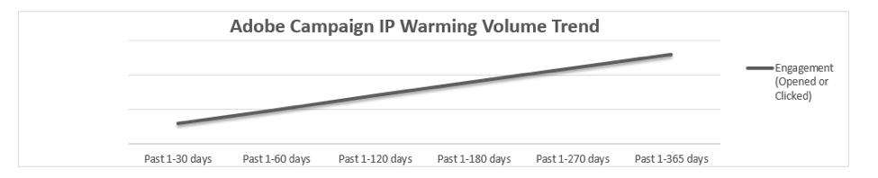

# Aumente sua reputação de email com o aquecimento de IP

<!--Increase your email reputation with IP warming

## IP Warming overview

In the Adobe Deliverability Consulting and Deliverability Operations teams, we have a vested interest in helping new Campaign customers be as successful as possible as they embark on the route of an IP warming process. If you’ve never been a part of such a project, you may have a lot of questions about it. Let’s get down to the details!-->

## Introdução

O Adobe exige que os clientes compartilhem suas configurações para ajudar a equipe de capacidade de entrega do Adobe a entender seu programa exclusivo. As perguntas que fazemos foram criadas para ajudar a equipe de Entregabilidade do Adobe a ter uma ideia da sua reputação de envio e do volume de email. Sem um entendimento concreto de seu modelo de negócios, metas de marketing por email e métricas de reputação, não poderemos personalizar a estratégia e há risco de problemas de deliverability.

No início, você receberá seus próprios endereços IP dedicados (Internet Protocol). No contexto de envio de email, um endereço IP é a rota usada para enviar suas mensagens de email aos clientes. Endereços IP e domínios são usados para identificar remetentes em uma rede para os ISPs receptores. O Adobe atribui o número apropriado de endereços IP dedicados para enviar emails, com base no volume de envio, programas de email, práticas de segmentação de dados e seu contrato.

**Tópicos relacionados:**
* [Como fazer a transição descomplicada ao alternar plataformas de email](../../help/transition-process/switching-email-platforms.md)
* [Estratégia de IP](../../help/transition-process/infrastructure.md#ip-strategy)
* [Considerações específicas do ISP durante o aquecimento de IP](../../help/transition-process/isp-specific-considerations-during-ip-warming.md)

## Aquecimento de IP: Por que isso é feito? {#why-ip-warming}

Os provedores de serviços de Internet (ISPs) ou os provedores de caixa de correio (MBPs) tomam precauções quando detectam um IP desconhecido e um domínio de envio. Esse é o procedimento padrão associado a quaisquer novos IPs de envio, independentemente do tipo de remetente. Os ISPs/MBPs colocam o IP e enviam o domínio sob grande análise para determinar se os emails enviados por esse IP e domínio são spam ou não.  Esse é o procedimento padrão associado a quaisquer novos IPs de envio, independentemente do tipo de remetente.

Os ISPs examinam cuidadosamente o volume de envio, a frequência de envio, as reclamações e as taxas de rejeição geradas por essas malas diretas. Todas elas são verificadas de perto porque são indicadores de reputação do remetente - seja bom ou ruim.

Naturalmente, este processo de análise destes pontos de dados leva tempo e não pode ser realizado num ou dois dias. A reputação é construída ao longo do tempo. Este processo é como deixar um estranho em sua casa. Você teria reservas de ter alguém que nunca conheceu entrando em sua casa?

Muito provavelmente a resposta é sim. Você gostaria de analisar essa pessoa e seus motivos. Eles significam dano? Eles são uma ameaça? Os ISPs fazem o mesmo para proteger sua rede contra tráfego mal-intencionado ou indesejado. Métricas de reputação positivas ajudam você a avançar muito em um processo bem-sucedido de aquecimento de IP. É por isso que enfatizamos a importância de começar a enviar pequenos volumes de email e começar a enviar primeiro para seus clientes altamente envolvidos. Para obter mais informações, consulte [Critérios de direcionamento ao enviar novo tráfego](/help/transition-process/targeting-criteria.md).

Enviar grandes quantidades de emails de um novo IP ou IPs totalmente novo é uma prática ruim e provavelmente causará algumas dificuldades de deliverability. É importante observar que, mesmo que você comece a enviar pequenos volumes e gradualmente aumentá-los conforme recomendado, ainda é necessário seguir as práticas recomendadas de email.

## Permissão para email (Aceitação explícita)

Esse é o componente mais importante do gerenciamento e crescimento de uma lista de email de assinantes. À medida que as leis antisspam crescem e se tornam mais abrangentes internacionalmente, isso deve ser o foco principal de um comerciante para garantir que ele tenha recebido consentimento explícito (ou expresso) de cada assinante em sua lista. Ou seja, cada assinante concordou ativamente em receber emails de sua marca. Isso é diferente do consentimento implícito, em que uma pessoa é adicionada a uma lista de email depois de realizar uma ação que não estava se inscrevendo explicitamente em um programa de email.

Saiba mais sobre [Política de uso aceitável do Adobe](https://www.adobe.com/legal/terms/aup.html).

## Métricas de reputação: O que os ISPs estão procurando?

Os ISPs usam tecnologia sofisticada para tomar decisões instruídas sobre fornecer ou não e-mails que estão recebendo de redes externas. Às vezes, eles têm algoritmos complicados e proprietários em seu conjunto de ferramentas para ajudá-los nesse processo.

Alguns dos pontos de dados examinados são:

* Ocorrências de captura de spam
* lista de bloqueios ocorrências
* Rejeições de email
* Participação do assinante

Os ISPs exigem configurações técnicas específicas que se alinham às políticas e práticas recomendadas. O Adobe configura seus IPs e subdomínios delegados para identificá-lo como um remetente responsável e confiável. Isso é chamado de [autenticação de email](/help/transition-process/infrastructure.md#authentication). A autenticação ajuda os receptores a validar se um remetente tem os direitos para enviar a partir desse IP ou domínio.

A autenticação permite que os ISPs validem se a empresa que está enviando de um domínio ou IP tem o direito de fazê-lo. É feito essencialmente para provar sua identidade e garantir que você não esteja fingindo ser outra pessoa e que outra pessoa não esteja fingindo ser você.

No Adobe, vamos configurar o SPF e o DKIM por padrão e vamos configurar o DMARC por solicitação. Os ISPs fazem referência ao SPF e DKIM como as principais formas de autenticação. Muitos ISPs também estão incorporando DMARC (Domain-based Message Authentication, Reporting &amp; Conformance) em suas decisões de filtragem. Os emails não autenticados não são necessariamente bloqueados, mas passam por filtragens adicionais.

## Aquecimento de IP: O que esperar

### Email com limitação ou bloqueio

Os remetentes de spam estão enviando de novos IPs o tempo todo - eles gravarão um pool de IPs até que sejam encerrados e repitam o processo em outro pool de IPs. Como resultado, os ISPs tratam cuidadosamente o tráfego sendo enviado de novos IPs. Eles impedem os IPs de enviar uma grande quantidade de email porque suspeitam que essa é uma atividade mal-intencionada que está sendo executada por remetentes de spam.

Consequentemente, não é incomum receber mensagens de diferimento ou limitadas quando você começa a enviar emails dos novos IPs. Depois de algumas tentativas, a mensagem geralmente é aceita e entregue.

Alcançar um fluxo normal de tráfego para os ISPs que adiam novos remetentes pode levar alguns dias. Mesmo assim, não pare de enviar emails - continue se concentrando apenas no envio para seus assinantes de email mais envolvidos.

Em casos raros, o ISP bloqueia o novo remetente. O Adobe está monitorando sua conta e, se tal bloco for suspeito, entrará em contato com o ISP para tentar ajudar a corrigir a situação da melhor maneira possível.

Lembre-se de que a consistência é fundamental aqui. Padrões de volume de envio irregulares e padrões de mala direta pouco frequentes causarão alguns desafios na capacidade de entrega ao longo do caminho.

### Reclamações

[Reclamações](/help/metrics/complaints.md) ocorrem quando um assinante rotula um email como spam por meio de seu programa de email. Isso envia um aviso ao ISP sobre a atividade de reclamação. Se houver muitas dessas reclamações que chegam ao ISP, esse ISP atuará para proteger seus clientes - possivelmente, bloqueará muitos emails de chegarem aos assinantes ou direcionar uma parte dos emails para a pasta de massa em vez das caixas de entrada dos assinantes. Se o problema com o delivery for causado por reclamações, é importante determinar por que os recipients estão reclamando.

Os assinantes reclamam por vários motivos. Às vezes, um assinante não quer receber mais emails, talvez porque sente que está recebendo muitas mensagens no mesmo tópico, ele não esperava a mensagem ou não se lembra de se inscrever para receber seus emails.

### Validade dos dados

As rejeições ocorrem quando você envia para um endereço que não pode ser entregue em um ISP. Um endereço pode não ser entregue por vários motivos, como um erro ao digitar o endereço ou ao enviar uma correspondência para um endereço que estava ativo anteriormente, mas foi fechado ou encerrado após um período de inatividade.

Se você encontrar um número substancial de devoluções permanentes, é importante entender o porquê. Revise como os endereços foram coletados e confirme que a permissão foi concedida. Às vezes, as pessoas fecham sua conta de email e não notificam aqueles que têm esse endereço em sua lista de marketing.

### Envolvimento

Os ISPs buscam um volume consistente e boa qualidade dos dados. Você aumentará o tráfego de forma lenta e constante nas próximas quatro a oito semanas. Às vezes, os aumentos exigem mais ou menos tempo com base no volume e nas metas, mas normalmente é um processo de pelo menos 8 semanas.

O tráfego de email deve ser implantado em uma progressão lenta e constante, aumentando a cada semana até que toda a lista seja enviada. Além disso, cada segmento seguirá a programação até a conclusão. Comece com os assinantes mais recentes primeiro e termine com os assinantes menos envolvidos por último. Observe também que alguns ISPs podem exigir uma abordagem mais personalizada devido à forma como lidam com o novo tráfego.

Saiba mais sobre [envolvimento](/help/engagement.md).

## Mantenha o curso

Você pode ficar tentado a acelerar o processo de aquecimento de IP enviando mais volume do que o recomendado, negligenciando o tempo gastando identificando seus assinantes mais envolvidos e não enviando esses assinantes primeiro em um esforço para criar uma reputação positiva. Por favor, resista a esta urgência! Não o ajudará a longo prazo.

É muito importante começar a enviar e-mails altamente engajados (com e-mail!) assinantes somente para os estágios iniciais de aquecimento de IP. Esses clientes são os mais valiosos e sua propensão para abrir seus emails ajudará a começar a mostrar aos ISPs que você é um profissional de marketing que envia emails interessantes e procurados. Também mostra ISPs que você está reproduzindo pelas regras e seguindo as práticas recomendadas.

## Conclusão 

Lembre-se: O aquecimento de IP é uma maratona - não uma corrida!  Embora o processo possa parecer pesado e demorado, seria mais trabalho tentar reparar uma reputação danificada por não seguir as práticas recomendadas de email comprovadas e verdadeiras.

Quanto melhor as suas práticas de envio e quanto maior a sua pontuação de reputação estiver com ISPs, maior a probabilidade de seus emails serem entregues. O aquecimento e o aumento de IP, juntamente com o cumprimento das práticas recomendadas para o design da sua mala direta, ajudarão a otimizar a entrega da sua caixa de entrada.

Nossa equipe global de deliverability é seu parceiro nesse processo e ajudará você durante essa fase de aquecimento de IP a posicioná-lo para obter sucesso.
