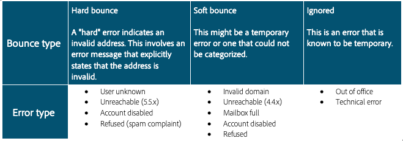

# Rejeições

As rejeições são o resultado de uma tentativa de entrega e falha em que o ISP fornece avisos de falha. O processamento do tratamento de rejeição é parte essencial da higiene das listas. Após um determinado email ser rejeitado várias vezes consecutivas, esse processo o sinaliza para supressão. O número e o tipo de rejeições necessárias para acionar a supressão variam de sistema para sistema. Esse processo impede que os sistemas continuem enviando endereços de email inválidos. As rejeições são um dos dados principais que os ISPs usam para determinar a reputação do IP. É muito importante acompanhar essa métrica. &quot;Entregue&quot; versus &quot;rejeitado&quot; é provavelmente a maneira mais comum de medir a entrega de mensagens de marketing: quanto maior a porcentagem entregue, melhor.

Vamos analisar dois tipos diferentes de rejeições.

## Rejeições permanentes

As rejeições permanentes são falhas permanentes geradas depois que um ISP classifica uma tentativa de envio por email para um endereço de assinante como não entregue. No Adobe Campaign, as rejeições permanentes categorizadas como não entregues são adicionadas à quarentena, o que significa que elas não retornarão novamente. Há alguns casos em que uma rejeição permanente é ignorada se a causa da falha for desconhecida.
Estes são alguns exemplos comuns de rejeições permanentes:

* Endereço não existe
* Conta desabilitada
* Sintaxe incorreta
* Domínio incorreto

## Rejeições temporárias

As rejeições temporárias são falhas temporárias que os ISPs geram quando têm dificuldade em entregar emails. As falhas leves serão repetidas várias vezes (com variação dependendo do uso de configurações de entrega personalizadas ou predefinidas) para tentar um delivery bem-sucedido. Os endereços que continuamente emitem rejeição não serão adicionados à quarentena até que o número máximo de tentativas tenha sido atingido (o que novamente varia de acordo com as configurações). Algumas causas comuns de rejeições temporárias incluem:

* Caixa de entrada cheia
* Servidor de email do destinatário inativo
* Problemas de reputação do remetente

>[!NOTE]
>
>As rejeições são o principal indicador de um problema de reputação, pois podem realçar uma fonte de dados incorreta (rejeição permanente) ou um problema de reputação com um ISP (rejeição temporária).
>
>As rejeições temporárias geralmente ocorrem como parte do envio de email e devem ter permissão para a resolução durante o processamento de nova tentativa antes de serem caracterizadas como um problema real de entrega. Se sua taxa de rejeição temporária for maior que 30% para um único ISP e não for resolvida em 24 horas, é importante relatar sua preocupação ao consultor de capacidade de entrega do Adobe Campaign.

## Recursos específicos do produto

**Adobe Campaign Classic**

* [Tipos e motivos de falha de entrega](https://experienceleague.adobe.com/docs/campaign-classic/using/sending-messages/monitoring-deliveries/understanding-delivery-failures.html?lang=pt-BRvery-failure-types-and-reasons)
* [Gestão de emails rejeitados](https://experienceleague.adobe.com/docs/campaign-classic/using/sending-messages/monitoring-deliveries/understanding-delivery-failures.html?lang=pt-BR#bounce-mail-management)
* [Relatório de não entregáveis e rejeições](https://experienceleague.adobe.com/pt-br/docs/campaign-classic/using/reporting/reports-on-deliveries/global-reports#non-deliverables-and-bounces)

**Adobe Campaign Standard**

* [Tipos e motivos de falha de entrega](https://experienceleague.adobe.com/pt-br/docs/campaign-standard/using/testing-and-sending/monitoring-messages/understanding-delivery-failures#delivery-failure-types-and-reasons)
* [Qualificação de email de rejeição](https://experienceleague.adobe.com/pt-br/docs/campaign-standard/using/testing-and-sending/monitoring-messages/understanding-delivery-failures#bounce-mail-qualification)
* [Relatório de resumo de rejeições](https://experienceleague.adobe.com/pt-br/docs/campaign-standard/using/reporting/list-of-reports/bounce-summary#reporting)
