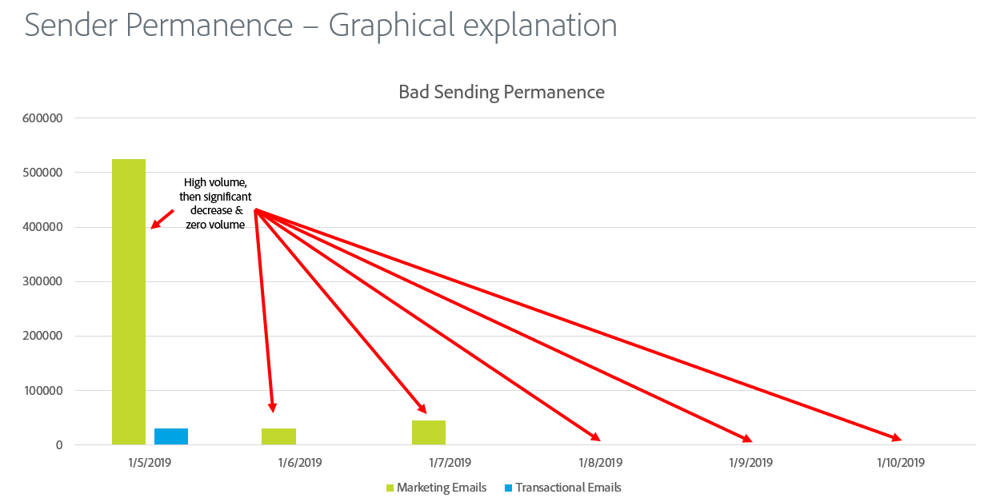

# Permanência do remetente

O envio de permanência é o processo de estabelecer um volume e uma estratégia de envio consistentes para manter a reputação do ISP. Estas são algumas razões pelas quais a permanência do remetente é importante:

* Os remetentes de spam normalmente &quot;Saltam endereços IP&quot;, o que significa que trocarão constantemente o tráfego em muitos endereços IP para evitar problemas de reputação.
* A consistência é fundamental para provar aos ISPs que o remetente é reputável e não está tentando ignorar problemas de reputação resultantes de práticas de envio inadequadas.
* É necessário manter essas estratégias consistentes por um longo período de tempo para que alguns ISPs sequer considerem o remetente respeitável.

**Veja alguns exemplos:**

