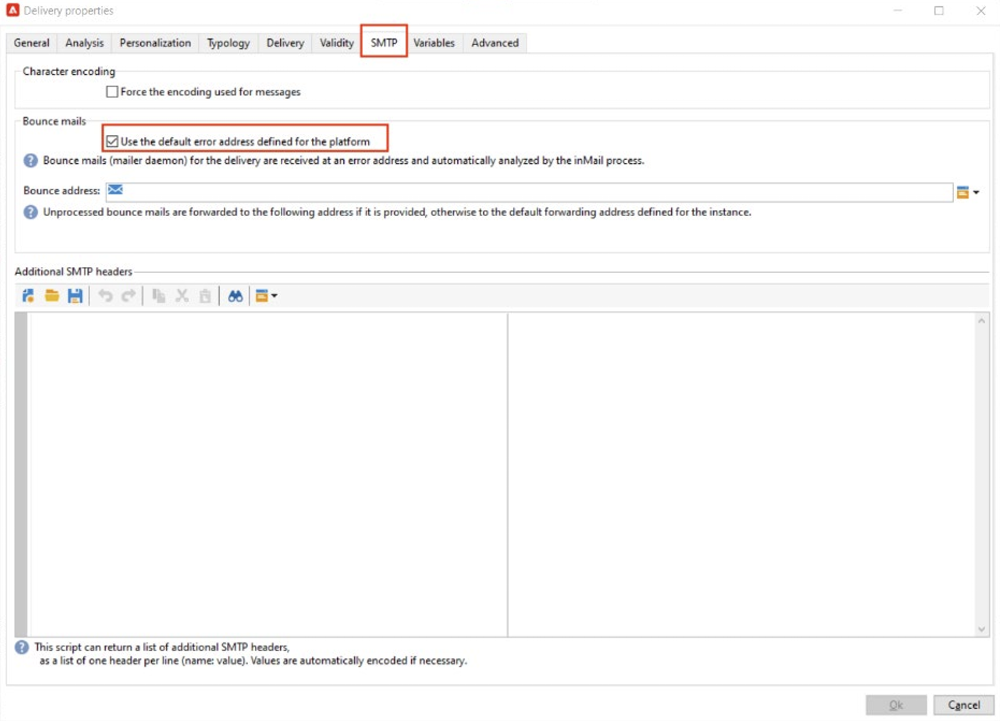

# Implementar [!DNL Domain-based Message Authentication, Reporting and Conformance] (DMARC)

O objetivo deste documento é fornecer ao leitor informações adicionais sobre o método de autenticação de email, DMARC. Ao explicar como o DMARC funciona e suas várias opções de política, os leitores entenderão melhor o impacto do DMARC na capacidade de entrega de email.

## O que é DMARC? {#about}

Autenticação de mensagens, relatórios e conformidade baseados em domínio é um método de autenticação de email que permite aos proprietários de domínio proteger seu domínio contra o uso não autorizado. O DMARC também fornece feedback sobre o status de autenticação do email e permite que os remetentes controlem o que acontece aos emails que falham na autenticação. Isso inclui opções para monitorar, colocar em quarentena ou rejeitar emails, dependendo da política DMARC implementada.

O DMARC tem três opções de política:

* **Monitor (p=nenhum):** Instrui o provedor de caixa de correio/ISP a fazer o que normalmente faria com a mensagem.
* **Quarentena (p=quarentena):** Instrui o provedor de caixa de correio/ISP a enviar emails que não transmitem DMARC para a pasta de spam ou lixo eletrônico do destinatário.
* **Rejeitar (p=reject):** Instrui o provedor de caixa de correio/ISP a bloquear emails que não passam DMARC, resultando em uma rejeição.

## Como o DMARC funciona? {#how}

O SPF e o DKIM são usados para associar um email a um domínio e trabalhar juntos para autenticar o email. O DMARC leva isso um passo além e ajuda a evitar falsificações, correspondendo ao Domínio verificado pelo DKIM e pelo SPF. Para passar DMARC, uma mensagem deve passar SPF ou DKIM. Se ambas as opções falharem na autenticação, o DMARC falhará e o email será entregue de acordo com a política DMARC selecionada.

>[!NOTE]
>
>O DMARC requer alinhamento entre os endereços ‘De’ e ‘Caminho de retorno’.

## Por que o DMARC deve ser implementado? {#why}

O DMARC é opcional e, embora não seja obrigatório, é gratuito e permite que os destinatários de email identifiquem facilmente a autenticação de emails, o que pode melhorar potencialmente a entrega. Um dos principais benefícios do DMARC é oferecer relatórios sobre quais mensagens falham no SPF e/ou DKIM. Também dá aos remetentes um grau de controle sobre o que acontece com emails que não passam por nenhum desses métodos de autenticação. Por meio do relatório DMARC, os remetentes obtêm visibilidade sobre quais mensagens estão falhando DMARC, permitindo que etapas sejam executadas para atenuar mais erros.

>[!NOTE]
>
>Se você quiser implementar o BIMI, será necessária uma política DMARC p=quarantine ou p=reject.

## Práticas recomendadas para a implementação do DMARC {#best-practice}

Como o DMARC é opcional, ele não será configurado por padrão em nenhuma plataforma do ESP. Um registro DMARC deve ser criado no DNS para que seu domínio funcione. Além disso, um endereço de email de sua escolha é necessário para indicar para onde os relatórios DMARC devem ir na organização. Como prática recomendada, é recomendável implantar lentamente a implementação DMARC escalando sua política DMARC de p=none, para p=quarantine, para p=reject à medida que você obtém a compreensão DMARC do impacto potencial da DMARC.

1. Analise o feedback que você recebe e usa (p=none), que instrui o destinatário a não executar nenhuma ação em relação às mensagens com falha de autenticação, mas ainda enviar relatórios de email ao remetente. Além disso, revise e corrija problemas com o SPF/DKIM se as mensagens legítimas estiverem falhando na autenticação.
1. Determine se o SPF e o DKIM estão alinhados e transmitem a autenticação para todos os emails legítimos e, em seguida, mova a política para (p=quarentena), que instrui o servidor de email de recebimento a colocar em quarentena os emails que falham na autenticação (geralmente significa colocar essas mensagens na pasta de spam).
1. Ajuste a política para (p=reject). A política p= reject informa ao destinatário para negar completamente (retornar) qualquer email para o domínio que não é autenticado. Com essa política ativada, somente os emails verificados como 100% autenticados pelo seu domínio terão uma chance de inserção na Caixa de entrada.

   >[!NOTE]
   >
   >Use essa política com cuidado e determine se ela é apropriada para sua organização.

## Relatório DMARC {#reporting}

O DMARC oferece a capacidade de receber relatórios sobre emails que falham no SPF/DKIM. Há dois relatórios diferentes gerados por servidores ISP como parte do processo de autenticação que os remetentes podem receber por meio das tags RUA/RUF em sua política DMARC:

* **Relatórios Agregados (RUA):** Não contém nenhuma PII (Informações de identificação pessoal) que seja sensível ao GDPR.
* **Relatórios Forenses (RUF):** Contém endereços de email que são sensíveis ao GDPR. Antes de usar o, é melhor verificar internamente como lidar com informações que precisam ser compatíveis com o GDPR.

O principal uso desses relatórios é receber uma visão geral dos emails que são tentados de falsificação. Esses relatórios são altamente técnicos e são melhor analisados por meio de uma ferramenta de terceiros. Algumas empresas especializadas em monitoramento DMARC são:

* [ValiMail](https://www.valimail.com/products/#automated-delivery)
* [Agari](https://www.agari.com/)
* [Demarciano](https://dmarcian.com/)
* [Proofpoint](https://www.proofpoint.com/us)

### Exemplo de registro DMARC {#example}

```
v=DMARC1; p=reject; fo=1; rua=mailto:dmarc_rua@emaildefense.proofpoint.com;ruf=mailto:dmarc_ruf@emaildefense.proofpoint.co
```

## Tags DMARC e o que elas fazem {#tags}

Os registros DMARC têm vários componentes chamados tags DMARC. Cada tag tem um valor que especifica um determinado aspecto do DMARC.

| Nome da tag | Obrigatório / Opcional | Função | Exemplo | Valor padrão |
|  ---  |  ---  |  ---  |  ---  |  ---  |
| v | Obrigatório | Essa marca DMARC especifica a versão. Há apenas uma versão a partir de agora, portanto, terá um valor fixo de v=DMARC1 | V=DMARC1 DMARC1 | DMARC1 |
| p | Obrigatório | Mostra a política DMARC selecionada e direciona o destinatário para relatar, colocar em quarentena ou rejeitar emails que não passaram nas verificações de autenticação. | p=nenhum, colocar em quarentena ou rejeitar | - |
| fo | Opcional | Permite que o proprietário do domínio especifique opções de relatório. | 0: Gerar relatório se tudo falhar<br/>1: Gerar relatório se algo falhar<br/>d: gerar relatório se o DKIM falhar<br/>s: Gerar relatório se o SPF falhar | 1 (recomendado para relatórios DMARC) |
| pct | Opcional | Informa a porcentagem de mensagens sujeitas à filtragem. | pct=20 | 100 |
| rua | Opcional (recomendado) | Identifica onde os relatórios agregados serão entregues. | `rua=mailto:aggrep@example.com` | - |
| ruf | Opcional (recomendado) | Identifica onde os relatórios forenses serão entregues. | `ruf=mailto:authfail@example.com` | - |
| sp | Opcional | Especifica a política DMARC para subdomínios do domínio pai. | sp=reject | - |
| adkim | Opcional | Pode ser Estrito (s) ou Relaxado (r). Alinhamento simples significa que o domínio usado na assinatura DKIM pode ser um subdomínio do endereço &quot;De&quot;. Alinhamento estrito significa que o domínio usado na assinatura DKIM deve corresponder exatamente ao domínio usado no endereço do remetente. | adkim=r | r |
| aspf | Opcional | Pode ser Estrito (s) ou Relaxado (r). Alinhamento relaxado significa que o Domínio do ReturnPath pode ser um subdomínio do Endereço do remetente. Alinhamento estrito significa que o domínio Return-Path deve ter uma correspondência exata com o endereço From. | aspf=r | r |

## DMARC e ADOBE CAMPAIGN {#campaign}

Um motivo comum para falhas do DMARC é o desalinhamento entre o endereço &quot;De&quot; e &quot;Para erros&quot; ou &quot;Caminho de retorno&quot;. Para evitar isso, ao configurar o DMARC, é recomendável verificar novamente suas configurações de endereço &quot;De&quot; e &quot;Erros para&quot; nos Modelos de entrega.

1. No Modelo de entrega, analise qual endereço está definido atualmente como seu endereço &quot;De&quot;.

   

1. Aqui, selecione &quot;Properties&quot; que permitirá editar ainda mais seu template do delivery. Nessa janela, selecione SMTP e desmarque &quot;Use the default error address defined for the platform&quot; (Usar o endereço de erro padrão definido para a plataforma) se selecionado. Os templates de delivery no Adobe Campaign marcam essa caixa de seleção por padrão. O Endereço de Erro padrão pode não ser o endereço associado ao Endereço do Remetente neste modelo de entrega.

   

1. Quando essa caixa estiver desmarcada, será exibido um campo de texto que permitirá inserir um Endereço de erro exclusivo que usa o mesmo domínio definido no Endereço de origem.

   

Depois que essas alterações forem salvas, você poderá prosseguir com a implementação DMARC com o alinhamento correto do domínio.

## Links úteis {#links}

* [DMARC.org](https://dmarc.org/){target="_blank"}
* [Autenticação de email M3AWG](https://www.m3aawg.org/sites/default/files/document/M3AAWG_Email_Authentication_Update-2015.pdf){target="_blank"}
