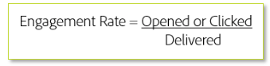

# Critérios de direcionamento

Ao enviar novo tráfego, direcione somente aos usuários mais engajados durante as fases iniciais do aquecimento de IP. Isso ajuda a estabelecer uma reputação positiva desde o início para criar confiança com eficiência antes de alcançar seus públicos menos envolvidos. Veja uma fórmula básica para o engajamento:

Normalmente, uma taxa de envolvimento se baseia em um período específico. Essa métrica pode variar bastante dependendo se a fórmula é aplicada em um nível geral ou para tipos de mala direta ou campanhas específicas. Os critérios de direcionamento específicos precisam ser fornecidos ao trabalhar com o consultor de capacidade de entrega da Adobe, já que cada remetente e ISP varia e geralmente requer um plano personalizado.

## Recursos específicos do produto

**Analytics**

* [Como aumentar as taxas de engajamento e retenção (tutorial)](https://experienceleague.adobe.com/docs/analytics-learn/tutorials/mobile-app-analytics/measuring-mobile-analytics/how-to-increase-engagement-and-retention-rates.html?lang=en#mobile-app-analytics): *Identifique públicos engajados por meio de seus comportamentos usando Coortes e saiba as causas subjacentes que geram aderência em seus aplicativos móveis. Use algoritmos de ciência de dados no Segment IQ para saber as diferenças e semelhanças entre os segmentos.*

**Campaign Standard**

* [Emails alimentados por IA: pontuação preditiva de engajamento](https://experienceleague.adobe.com/docs/campaign-standard/using/testing-and-sending/preparing-and-testing-messages/predictive.html#predictive-scoring)
